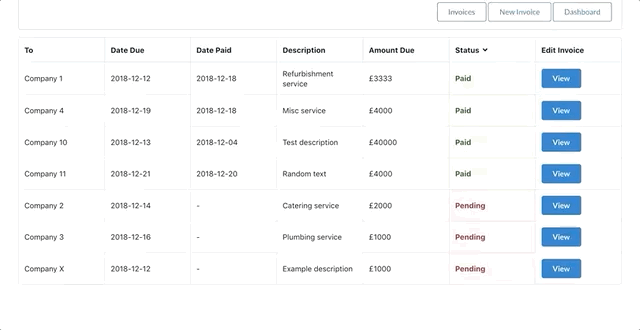

# (NOTE: New features are being added and the invoicing backend and frontend system are undergoing a major restructuring)


# Invoicer

Create, list and edit your invoices with this simple web app. 

# Demo

https://invoicer-c6c19.firebaseapp.com

# Preview



# Installation 

- From your command line, ```cd``` into the main folder
- Run ```'npm install'``` to install the required module dependencies
- Run ```'npm start'``` to run the app.
- IMPORTANT: Only run the app on ```'localhost:3000'``` as the backend will only accept requests from that point

